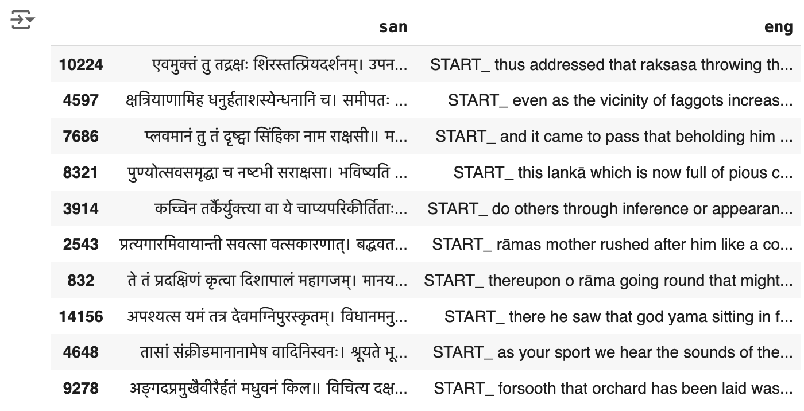
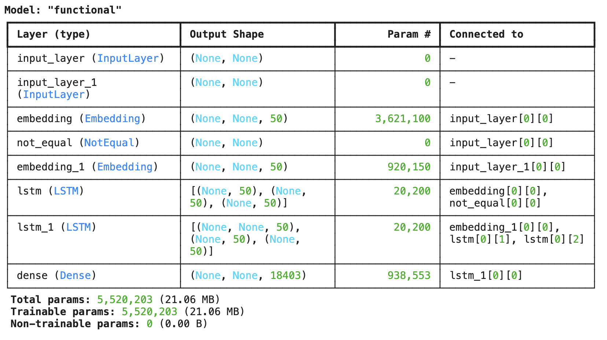
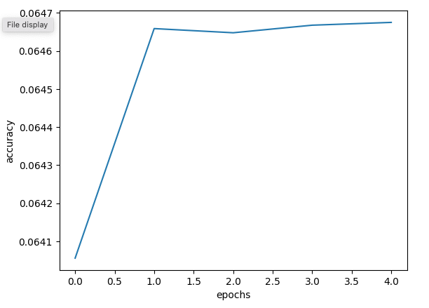
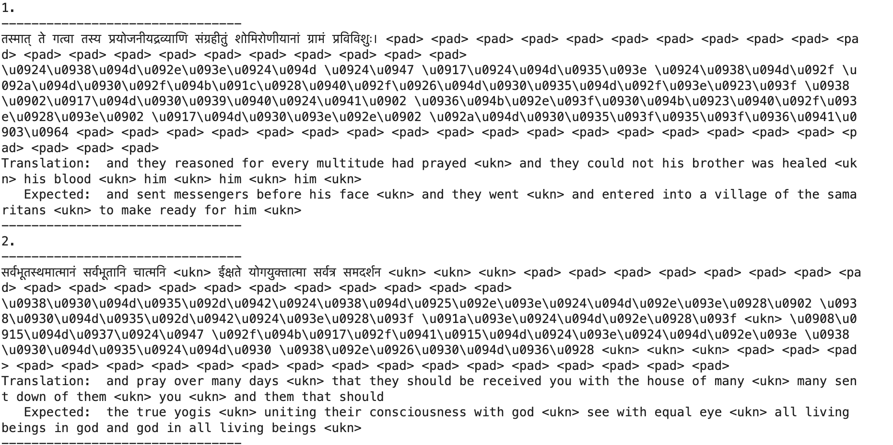
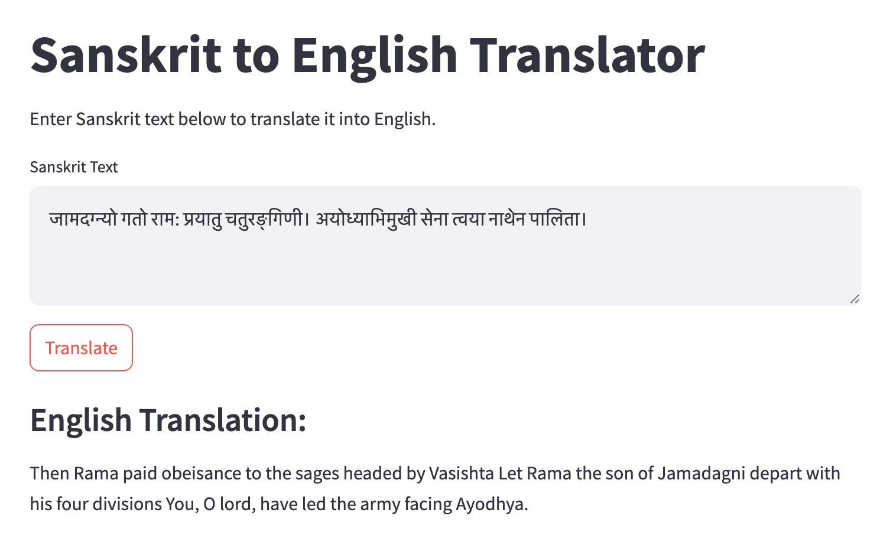

# Sanskrit to English Translation
 ### Sahasra Kamatam- 4th Semester
- Sanskrit to English Translation
- Prepared for UMBC Data Science Master Degree Capstone by Sahasra Kamatam under the guidance of Dr Chaojie (Jay) Wang
- Author Name: Sahasra Kamatam
- LinkedIn: [Sahasra Kamatam](https://www.linkedin.com/in/sahasra-kamatam/)
- GitHub: [Sahasra Kamatam](https://github.com/sahasrask)
- PowerPoint presentation:(https://github.com/sahasrask/UMBC-DATA606-Capstone/docs/SanToEng_Presentation.pptx)
- Youtube Link: 
    
## 1. Introduction
Sanskrit is one of the oldest languages and is known for its precision basically Its words changes based on grammar rules like cases, gender, and number by giving each word a variety of meanings depending on its form. 
English, on the other hand, has a simpler structure and relies more on word order to convey meaning, this creates a gap in how sentences are understood in each language.
#### Research Questions
- How can modern NLP techniques, particularly Transformer-based models, be adapted to accurately capture the complex grammatical structures of Sanskrit in order to improve translation quality into English?
- What are the limitations of existing multilingual models when applied to low-resource languages like Sanskrit, and how can fine-tuning or transfer learning be leveraged to enhance translation accuracy?
- How does the scarcity of parallel Sanskrit-English datasets impact the performance of machine translation models, and what strategies can be employed to mitigate data limitations?
-  How effective are attention mechanisms and context-handling techniques in disambiguating multiple meanings of Sanskrit words during translation?
- What evaluation metrics are best suited for assessing the grammatical and semantic accuracy of Sanskrit-to-English translations, and how can these be applied to optimize the model?
  
## 2. Data 

- The dataset taken from the dataset library: "rahular/itihasa"
- Dataset contains Train and Test Data of Sanskrit to English translated sentences.
- Sanskrit and Enlish translations has its seperate text file like test.en, test.sb, train.en, train.sn.
- Train dataset contains 75162 sentences and 1 feature of Sanskrit text and Enlish translation of Sanskrit sentences. 
- Test dataset contains 24217 sentences and 1 feature of Sanskrit text and Enlish translation of Sanskrit sentences. 
- Dataset is downloaded in the project file. 

## 3. Data Prepocessing
- Data is downloaded from dataset library: "rahular/itihasa" and extracted the translations from the train dataset.
- Extracted Sanskrit and English sentences from each entry and stored in different lists.
- Data Cleaning is done by performing the below steps
     - Lowercasing all the characters
     - Removing Quotes
     - Removing all Special characters
     - Removing numbers.
     - Removing Extra Spaces.
     - Added "START_" and "_END" tokens marking the start and end of target language sequences.
- Processed English and Sanskrit sentences (or phrases) stored in a lists and extracted unique words from those sentences, and counts the total number of unique words.
- From the data we got 72422 and 18402 unique words from Sanskrit and English sentences respectively.
- Created dictionaries to map words to unique indices.
- Create reverse dictionaries to map indices back to words.

## 4. Model Training
- **Encoder-Decoder Long Short-Term Memory Algorithm**
  - Partition a dataset comprising Sanskrit (san) and English (eng) sentences into training and testing subsets, structure the data into organized DataFrames, and save the resulting datasets for future use.
  - LSTM algorithm is a data generator for training sequence-to-sequence models, typically used in machine translation tasks.
  - The model is used to prepare batches of data for the encoder and decoder during training, ensuring that data is processed efficiently in chunks (batches).
  - Built a sequence-to-sequence (seq2seq) model using the Keras library, suitable for tasks like machine translation or text generation. It consists of an encoder-decoder architecture with LSTM (Long Short-Term Memory) layers for handling sequential data.

  

  - The output shows a summary of the model architecture, listing each layer, its type, the shape of the output, the number of parameters (trainable values), and how the layers are connected.
  - The Input layers receive sequences of unspecified length (indicated by (None, None)).
  - Embedding layers convert input words into 50-dimensional vectors. One embedding layer handles the source language, and the other handles the target language.
  - LSTM layers process these embeddings to capture the sequence information and output hidden states and cell states of size 50.
  - The final Dense layer outputs a probability distribution over 18,403 possible target tokens (words).
  - The model has about 5.5 million trainable parameters, meaning that the model will learn by adjusting these values during training.

- **Plotting Training and Validation:**
  - Saved the trained model's weights to a file named "nmt_model.weights.h5." which allows reloading the weights later without re-training.
    
    

  - The plot displays the model's performance over epochs(training vs. validation accuracy) to detect overfitting or underfitting.
    
## 6. Results
- The model was trained over 5 epochs with the Training accuracy, Training loss, Validation accuracy and Validation loss observations
   

- Output shows 64 percent accuracy for translation.

## 7. Application of the Trained Models

- **Streamlit Application :** For machine learning and data science projects, Streamlit is an open-source Python toolkit that makes it easier to create and distribute eye-catching, unique web applications. Because of its intuitive and user-friendly design, developers may create interactive applications with little to no code.

- Streamlit has many benefits, including simple deployment, real-time engagement, connectivity with data science libraries, and ease of use. It also offers choices for altering the arrangement to meet various project specifications.

- This is the webpage we developed using streamlit application. We can directly enter the Sanskrit text and click the Translate button then it runs the model in the background and gives us the output of English Translated text.

## 8. Conclusion
- Summary: This project explored the challenges and approaches for Sanskrit-to-English translation using Encoder-Decoder LSTM models, highlighting the unique complexities of Sanskrit’s syntax, morphology, and context-dependent meanings.
- Achievements: Successfully developed a model that translates basic Sanskrit sentences, paving the way for enhanced accessibility of Sanskrit texts in academia and beyond.
- Challenges and Limitations: Handling complex sentence structures, compounded words, and data scarcity remains a challenge, impacting translation accuracy.
- Future Potential: With advancements like Transformer models, attention mechanisms, and domain-specific fine-tuning, the model can be improved for better accuracy and wider application.
- Final Thought: This work contributes to bridging the gap between ancient and modern languages, making Sanskrit's rich cultural and intellectual heritage more accessible in the digital age.

## 9. References 

1. https://www.sciencedirect.com/science/article/pii/S2949719123000225
2. https://www.researchgate.net/publication/372291162_An_evaluation_of_Google_Translate_for_Sanskrit_to_English_translation_via_sentiment_and_semantic_analysis
3. https://aclanthology.org/2020.icon-main.30.pdf
4. https://arxiv.org/abs/2303.07201
